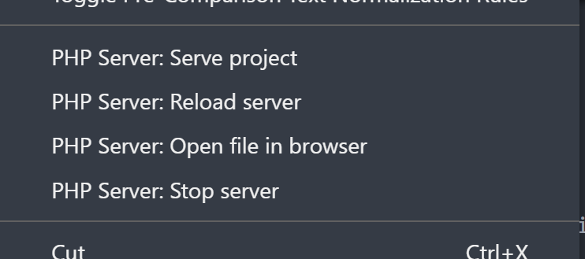
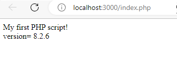

[back to index](readme.md)

---

## 1 Get Start of PHP

### 1 install php

- 1.1 install PHP with MySql by follow below two steps

    - For beginner, could try install `XAMPP`
     [install the most popular PHP MySql development environment](./SAMPP/install_XAMPP.md)

    - Add PHP path to system environment
     [Add PHP path to system environment](./1_getStartPhp/config_php.md)

### 2 install vscode php extension

- 2.1 install the `Php Server`
- 2.2 install `PHP` (All-in-One PHP support)
- 2.3 selected the index.php and chose `Php Server:Serve project`



- 2.4 Test your Hello World php script

```php
// helloworld.php
<?php
    echo 'Hello World!'
?>

```

- 2.5 Try your first php in Html page

```php
/*
    MyFirstPhp.php
*/
    <!DOCTYPE html>
    <html>
    <body>

    <?php
    echo "My first PHP script!<br>";
    $version = phpversion();
    echo "version=";
    ?>
    <?=$version ?>
    <br>
    </body>
    </html>
```



### 3 Php Code Examples

- Basic samples
  - [index.php](./1_getStartPhp/index.php)
  - [array](./1_getStartPhp/samples_array.php)
  - [class](./1_getStartPhp/samples_class.php)
  - [Json](./1_getStartPhp/samples_json.php)

- Form example 1 (2 page)
  - [form_welcome.php](./1_getStartPhp/sample_form/form_welcome.php)
  - [welcome.php](./1_getStartPhp/sample_form/welcome.php)

- Form example 2 (self post)
  - [form_self.php](./1_getStartPhp/sample_form/form_self.php)


---

   [next chapter-> 2.MySql](2.mysql.md)
   [back to index](readme.md)
