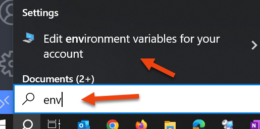
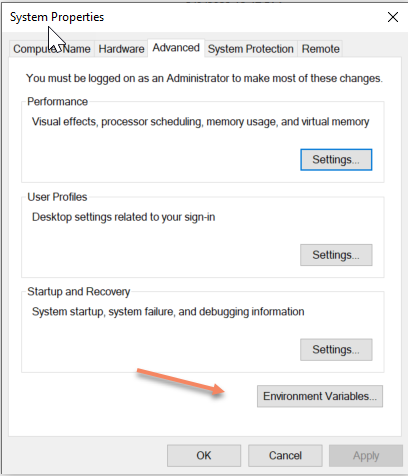
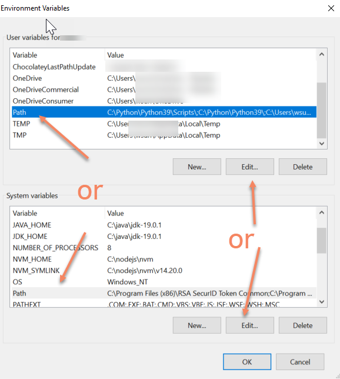
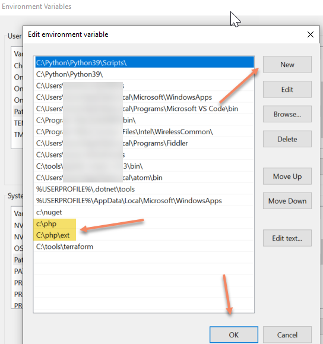
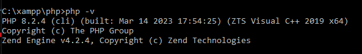

[back to 1.get start PHP](../1.getStartPhp.md)

---

# install and config PHP 

For more details please check:
<https://www.geeksforgeeks.org/how-to-install-php-in-windows-10/> 

## 1 Download and install PHP

1.1 Download the XAMPP (php + mySql + apache bundle)

- download from: https://www.apachefriends.org/

1.2 Download and install php only

- a. download from <https://windows.php.net/download>
  - select non thread safe window  `VS16 x64 Non Thread Safe`
- b. unzip to c:\php folder

## 2 Config PHP

2.1 Add PHP path to system environment

- your php be unzip to c:\php (if you installed through XAMPP, your php folder will be C:\xampp\php)

- Add c:\php or C:\xampp\php to system environment Path for php used for other apps like VsCode
- click on Start Menu and search “Edit the system environment variables” and open it

- After opening System, Variable New window appears, and click on "Environment Variables…"

- Open the environments `Path``

- Add new environment path `c:\php` or `c:\xampp\php` and save
- We need use php extension for `mySql`, add the path `c:\php\ext` or `c:\xampp\php\ext` to the patch
  
  
2.2 Test Php
  - Then open command prompt, run `php -v`
  

---
[back to 1.get start PHP](../1.getStartPhp.md)