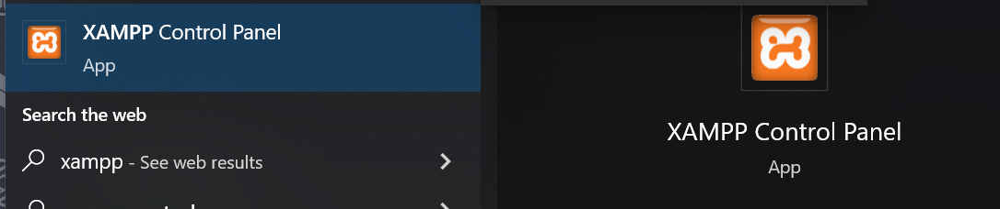
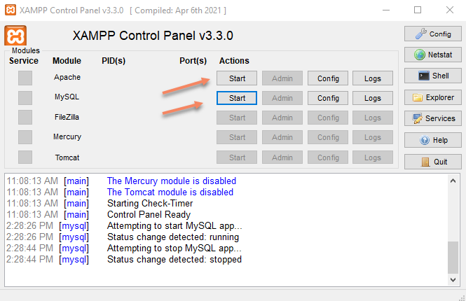
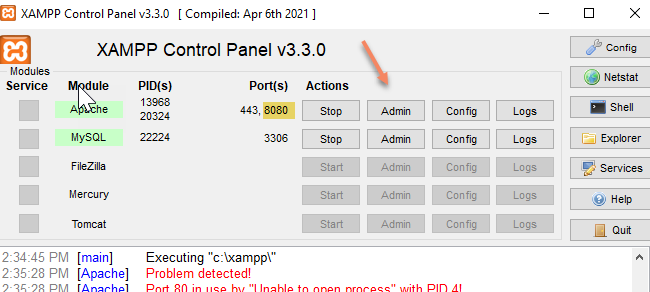
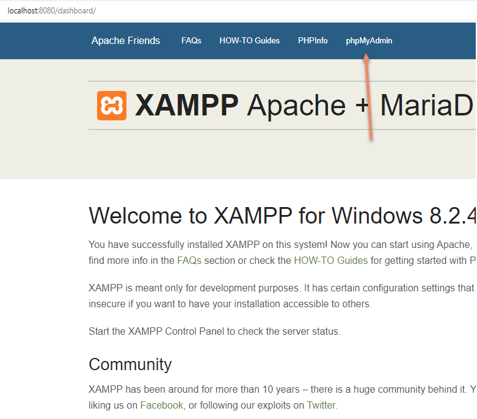
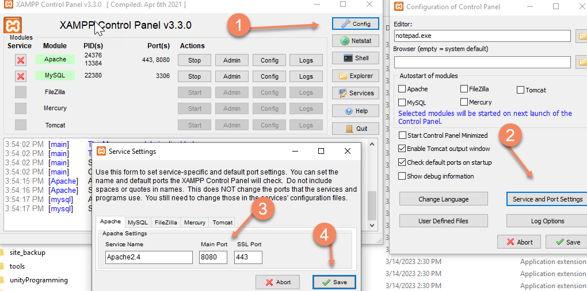
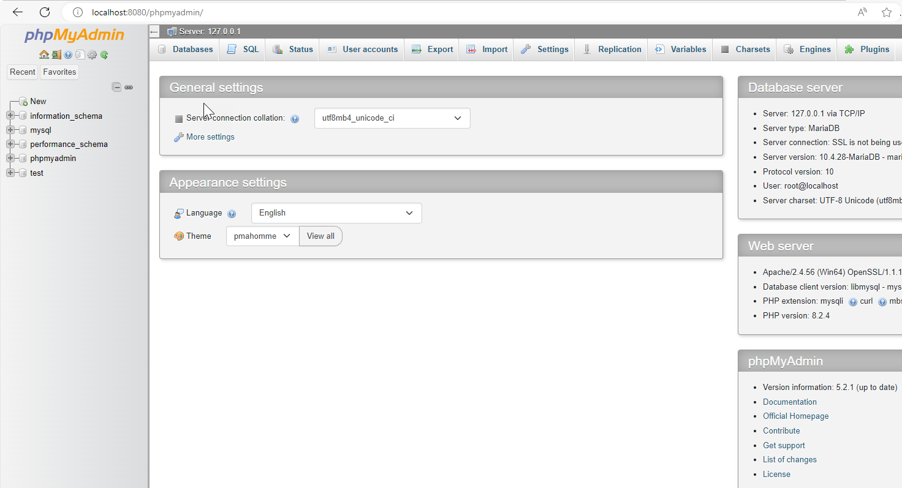

# How to use XAMPP

**XAMPP is the most popular PHP development environment**

## 1. Download and install XAMPP

(**Recommend for beginner**) Download and install `XAMPP` the popular PHP-MySql development environment
    - download from: <https://www.apachefriends.org/>

## 2. Use XAMPP

### 2.1 XAMPP tutorial

you could learn how to use XAMPP through youtube tutorials

- [[youtube]XAMPP tutorial for beginners (8min)](https://www.youtube.com/watch?v=r0lDDeVkaks)
- [[youtube] XAMPP TUTORIAL FOR BEGINNERS (17min)](https://www.youtube.com/watch?v=JpOIKOAYUgs)
- [[youtube] How To Run PHP Projects in XAMPP Server](https://www.youtube.com/watch?v=Op5TTJPCtso)

### 2.2 Use XAMPP MySql Admin UI

- 1 run XAMPP Control panel

- 2 start the Apache service and MySql service

- 3 Open the XAMPP dashboard

  - you may need change apache port if port 80 is not available <https://www.youtube.com/watch?v=E9bLYwcuiSk>
  - you could find or add the php code in c:\xampp\htdocs and visit the site by http://localhost:8080 (if you change port to 8080)
  - you also need change the XAMPP admin service port to use your new port, (*you need run XAMPP with `run as administrator` if you got permission deny error.* )
  

- 4 Oen the mySql admin ui `phpMyAdmin`
 

- 5 for how to use phpMyAdmin 
    - <https://www.tutorialspoint.com/phpmyadmin/index.htm>