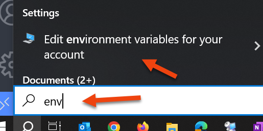
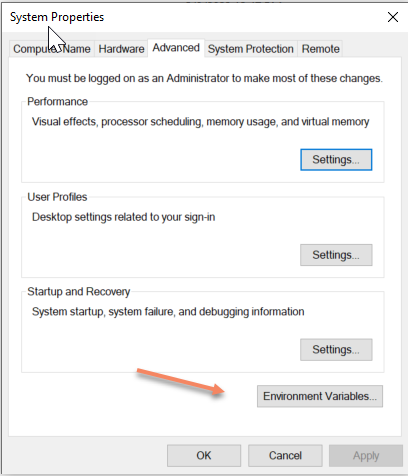

# install and config PHP 

For more details please check:
<https://www.geeksforgeeks.org/how-to-install-php-in-windows-10/> 

## 1 Download and install PHP

1.1 Download the XAMPP (php + mySql + apache bundle)
 - download from: https://www.apachefriends.org/

1.2 Download and install php only

  - a. download from <https://windows.php.net/download>
    - select non thread safe window  `VS16 x64 Non Thread Safe`
  - b. unzip to c:\php folder

## 2 Config PHP

2.1 Add PHP path to system environment
  - your php be unzip to c:\php (if you installed through XAMPP, your php folder will be C:\xampp\php)
  - Add c:\php or C:\xampp\php to system environment Path for php used for other apps like VsCode
  - click on Start Menu and search “Edit the system environment variables” and open it
  
  - After opening System, Variable New window appears, and click on "Environment Variables…"
  
  - Open the environments `Path``
  
  - Add new environment path `c:\php` or `c:\xampp\php` and save
  - We need use php extension for `mySql`, add the path `c:\php\ext` or `c:\xampp\php\ext` to the patch
  
  
2.2 Test Php 
  - Then open command prompt, run `php -v`
  