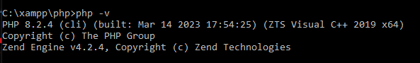
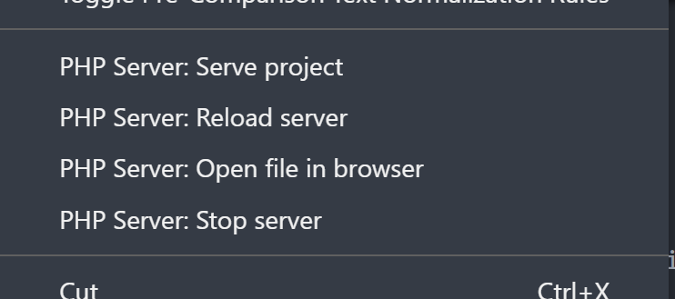
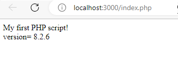

## Get Start of PHP

### 1 install php

1.1 install PHP with MySql

  for beginner, could try install `XAMPP`, check details in [2.mysql](2.mysql.md) about how install mysql with php

1.2 install PHP only

 [Reference] <https://www.geeksforgeeks.org/how-to-install-php-in-windows-10/>

  - a. download from <https://windows.php.net/download>
    - select non thread safe window  `VS16 x64 Non Thread Safe`
  - b. unzip to c:\php folder

1.3 Add PHP path to system environment
  - Through XAMPP, your php folder will be C:\xampp\php
  - Add c:\php or C:\xampp\php to system environment Path for php used for other apps like VsCode
  - click on Start Menu and search “Edit the system environment variables” and open it
  - After opening System, Variable New window appears, and click on “Environment Variables…”
  
  - Then open command prompt, run `php -v`
  
### 2 install vscode php extension

2.1 install the `Php Server`
2.2 install `PHP` (All-in-One PHP support)
2.3 selected the index.php and chose `Php Server:Serve project`



2.4 Load my first php page

```php
    <!DOCTYPE html>
    <html>
    <body>

    <?php
    echo "My first PHP script!<br>";
    $version = phpversion();
    echo "version=";
    ?>
    <?=$version ?>
    <br>
    </body>
    </html>
```



### 3 Examples

- Basic samples
  - [index.php](./index.php)
  - [array](./samples_array.php)
  - [class](./samples_class.php)
  - [Json](./samples_json.php)

- Form example 1 (2 page)
  - [form_welcome.php](./1_form/form_welcome.php)
  - [welcome.php](./1_form/welcome.php)

- Form example 2 (self post)
  - [form_self.php](./1_form/form_self.php)

## Install MySql

   [check 2.MySql](2.mysql.md)
